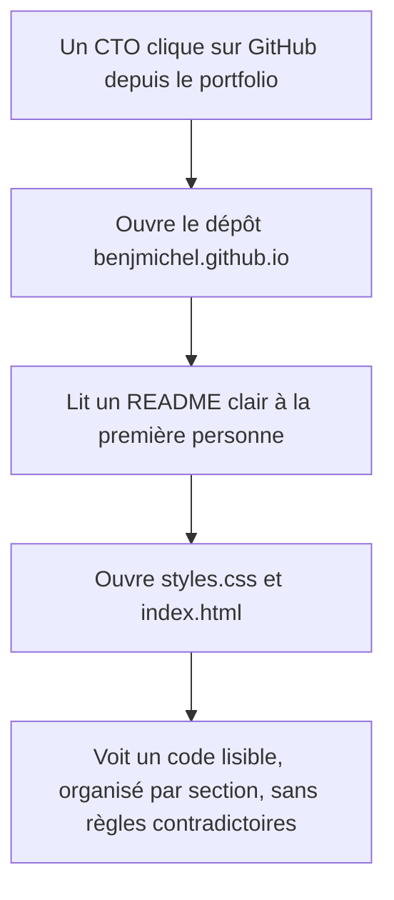
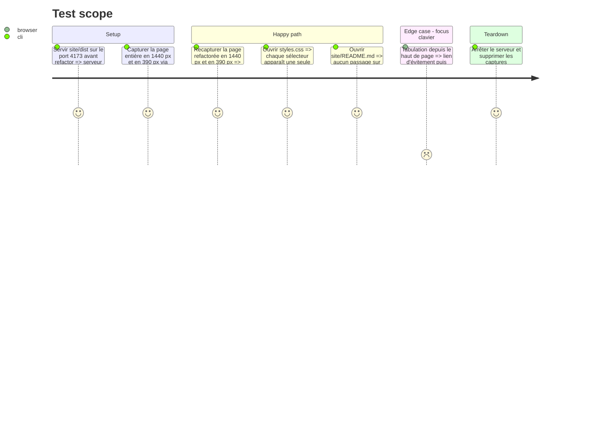

<!-- Fill or omit these sections; never add, rename, or reorder one. -->

# Instruction: Dépôt présentable — CSS consolidé, HTML lisible, README réécrits

## Architecture projection

> Tree of the final files. ✅ create · ✏️ modify · ❌ delete

```txt
.
├── README.md                 ✏️ présentation du dépôt à la première personne, lien vers site/README.md
└── site/
    ├── README.md             ✏️ doc technique (structure, lancer, publier) ; le journal de recherche sur LinkedIn disparaît
    └── dist/
        ├── index.html        ✏️ indenté, un bloc par ligne, aucun texte ni attribut changé
        └── styles.css        ✏️ non minifié, une seule règle par sélecteur, couches d'overrides fusionnées, variables renommées
```

## User Journey



## Test Scope



## Tasks to do

### `1)` Capturer les références visuelles

> Figer le rendu actuel pour prouver que le refactor ne change rien.

1. Servir `site/dist` (`python3 -m http.server 4173 --directory site/dist`).
2. Capturer en Chrome headless la page entière à 1440 px de large.
3. Capturer à 390 px via une page hôte contenant une `<iframe>` de 390 px (Chrome headless impose une largeur minimale de 500 px).
4. Utiliser `--virtual-time-budget` pour que les polices soient chargées ; stocker les captures hors du dépôt.

### `2)` Consolider `styles.css`

> Une feuille lisible, organisée par section, sans couches qui se contredisent.

1. Déminifier : une déclaration par ligne, sections commentées dans l'ordre de la page (base, header, hero, expertise, parcours, Tilli, projets, citation, contact, footer).
2. Fusionner les blocs « Alphard », « Supplied portrait » et « Tilli » dans les règles d'origine : ne garder que la valeur effective (ex. `.hero{padding-top}` défini trois fois, `.contact{background}` écrasé, `.header .wordmark` vs `.wordmark`).
3. Regrouper les media queries par point de rupture (1500, 1000, 700 px, `prefers-reduced-motion`).
4. Renommer les variables trompeuses : `--white` (bleu nuit) devient un nom de rôle, ex. `--on-ink` ; ajouter des variables pour les couleurs codées en dur répétées (`#acc5ff`, `#a9b5c8`, `#eaeef7`).
5. Supprimer les règles mortes (sélecteurs sans élément correspondant, déclarations toujours écrasées).

### `3)` Rendre `index.html` lisible

> Le HTML doit pouvoir servir d'échantillon de code.

1. Indenter le document ; un élément de bloc par ligne.
2. Ne modifier aucun texte, attribut ni ordre d'élément.

### `4)` Réécrire les README

> Un README de développeur, pas un journal d'agent.

1. `README.md` : présentation à la première personne, lien vers le site, lancement local, structure.
2. `site/README.md` : structure des fichiers, palette et identité Alphard, filtres SVG, publication GitHub Pages.
3. Retirer la section « Contenu et sources » (consultation de LinkedIn, « aucune adresse e-mail n'a été devinée ») et la mention de l'outil imagegen ; garder la description de l'illustration si utile.

### `5)` Vérifier la non-régression

> Prouver le zéro changement visuel.

1. Recapturer en 1440 et 390 px dans les mêmes conditions.
2. Comparer avec `magick compare -metric AE` ; tout pixel différent est corrigé avant de terminer.

## Test acceptance criteria

| Task | Acceptance criteria |
| ---- | ------------------- |
| 1 | Deux captures de référence (1440 px, 390 px) existent hors du dépôt avant toute modification. |
| 2 | `styles.css` est lisible ligne à ligne, chaque sélecteur n'est déclaré qu'une fois par contexte de media query, aucune variable ne porte un nom contraire à sa valeur. |
| 3 | `index.html` est indenté et son contenu textuel est identique à l'original (diff du texte extrait vide). |
| 4 | Les deux README sont écrits à la première personne ou de façon neutre, ne mentionnent ni la consultation de LinkedIn ni imagegen, et décrivent comment lancer et publier le site. |
| 5 | La comparaison des captures avant/après renvoie 0 pixel différent en 1440 px et en 390 px. |
