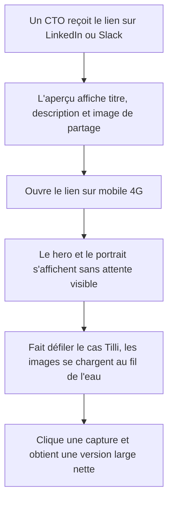
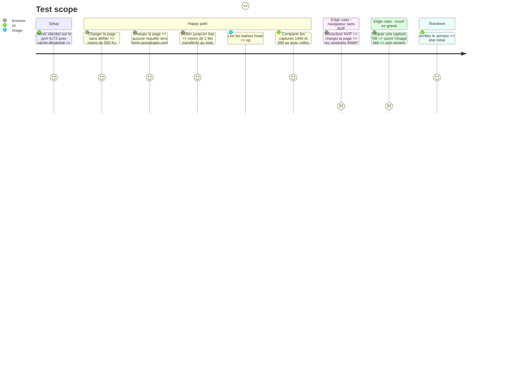

<!-- Fill or omit these sections; never add, rename, or reorder one. -->

# Instruction: Performance et partage — images AVIF/WebP, polices auto-hébergées, og:image

## Architecture projection

> Tree of the final files. ✅ create · ✏️ modify · ❌ delete

```txt
.
├── scripts/
│   └── optimize-images.sh               ✅ régénère toutes les variantes depuis site/sources/ (sips/cwebp/magick, déjà installés)
└── site/
    ├── README.md                        ✏️ documente le pipeline d'images, les polices et l'image de partage
    ├── sources/                         ✅ originaux versionnés, non publiés
    │   ├── alphard-banner.png           ✅ déplacé depuis dist/assets
    │   ├── alphard-hydra.png            ✅ déplacé depuis dist/assets
    │   ├── alphard-logo.png             ✅ déplacé depuis dist/assets
    │   ├── benjamin-michel.jpg          ✅ déplacé depuis dist/assets
    │   ├── og-card.html                 ✅ gabarit 1200×630 de l'image de partage
    │   └── tilli/*.png                  ✅ les 7 captures Tilli déplacées
    └── dist/
        ├── index.html                   ✏️ <picture>/srcset, preload police, balises og:image et twitter:card
        ├── styles.css                   ✏️ @font-face locales, image-set() pour les fonds, plus d'@import
        └── assets/
            ├── alphard-banner.png       ❌ remplacé par hero-stars.avif / .webp (tiers gauche seul visible)
            ├── alphard-hydra.png        ❌ remplacé par hydra-600.avif / .webp
            ├── alphard-logo.png         ❌ remplacé par alphard-logo-168.png (filtre SVG conservé)
            ├── benjamin-michel.jpg      ❌ remplacé par les variantes portrait-350 / portrait-700 + repli JPEG sans EXIF
            ├── hero-stars.avif, .webp   ✅
            ├── hydra-600.avif, .webp    ✅
            ├── alphard-logo-168.png     ✅
            ├── portrait-350 et portrait-700 en .avif, .webp, .jpg ✅
            ├── og-image.jpg             ✅ 1200×630, < 150 Ko
            ├── fonts/
            │   ├── dm-sans-latin.woff2              ✅ variable, axe wght (400–700)
            │   ├── instrument-serif-latin.woff2     ✅ romain (citation)
            │   └── instrument-serif-italic-latin.woff2 ✅ italique (titres, stack-note)
            └── tilli/
                ├── architecture-tilli.svg           (inchangé)
                ├── *.png                            ❌ les 7 PNG déplacés vers site/sources/tilli/
                └── variantes .avif / .webp par capture ✅ largeur d'affichage ×2 + une version large pour « ouvrir en grand »
```

## User Journey



## Test Scope



## Tasks to do

### `1)` Déplacer les originaux et écrire le script d'optimisation

> Une seule commande régénère toutes les images publiées.

1. Déplacer les originaux raster vers `site/sources/` avec `git mv` (historique conservé).
2. Écrire `scripts/optimize-images.sh` : AVIF via `sips`, WebP via `cwebp`, recadrage/redimensionnement via `magick`, métadonnées EXIF supprimées.
3. Bannière : ne garder que le tiers gauche réellement affiché (le CSS actuel l'étire à 300 %), exporté à sa résolution native.
4. Hydre : 600 px de côté (affichée en 570/440 px à 9 % d'opacité).
5. Portrait : 350 et 700 px de large (1x/2x), plus un JPEG de repli sans EXIF.
6. Logo : PNG 168 px sans perte (le filtre SVG `logo-alpha` supprime le fond clair, la compression avec perte laisserait un halo).
7. Captures Tilli : largeur d'affichage ×2 en AVIF/WebP, plus une version large (≤ 1600 px) pour le lien « ouvrir en grand ».

### `2)` Servir les images optimisées

> Le navigateur choisit le format le plus léger.

1. Remplacer chaque `` raster par un `<picture>` AVIF → WebP → repli, avec `width`, `height`, `loading`, `alt` conservés sur l'``.
2. Ajouter `srcset`/`sizes` au portrait et aux captures Tilli.
3. Pointer les liens « ouvrir en grand » vers la version large.
4. Fonds CSS (bannière, hydre) : `image-set()` AVIF/WebP ; adapter `background-size` au recadrage de la bannière sans changer le rendu.

### `3)` Auto-héberger les polices

> Plus de chaîne `@import` bloquante ni d'appel à Google.

1. Télécharger les `woff2` latin de DM Sans (variable) et d'Instrument Serif (romain + italique), licence OFL.
2. Déclarer les `@font-face` avec `font-display: swap` en tête de `styles.css` ; supprimer l'`@import`.
3. Ajouter `<link rel="preload" as="font" type="font/woff2" crossorigin>` pour DM Sans.

### `4)` Créer l'image de partage

> Un lien partagé sur LinkedIn ou Slack affiche un aperçu soigné.

1. Créer `site/sources/og-card.html` (1200×630, palette Alphard, nom, rôle, accroche, portrait).
2. Le rendre en JPEG via Chrome headless (`--window-size=1200,630`) dans `site/dist/assets/og-image.jpg`.
3. Ajouter `og:image` (URL absolue), `og:image:width`, `og:image:height`, `og:image:type`, `og:image:alt`, `og:locale`, `twitter:card=summary_large_image`.

### `5)` Mesurer et documenter

> Prouver le gain et permettre de le reproduire.

1. Mesurer le poids transféré au chargement et après défilement complet (Performance API ou Lighthouse en local).
2. Comparer le rendu avec des captures du commit de fin de phase 1 (les refaire depuis ce commit si elles ne sont plus disponibles), via SSIM.
3. Documenter dans `site/README.md` : commande de régénération, emplacement des sources, polices, image de partage.

## Test acceptance criteria

| Task | Acceptance criteria |
| ---- | ------------------- |
| 1 | `site/dist/assets` ne contient plus aucun original raster ; relancer `scripts/optimize-images.sh` reproduit les mêmes fichiers ; le portrait publié ne porte aucune métadonnée EXIF. |
| 2 | Le premier chargement sans défilement transfère moins de 500 Ko ; un navigateur sans AVIF reçoit le WebP ; « ouvrir en grand » affiche une image nette d'au moins 1200 px de large. |
| 3 | Aucune requête ne part vers un domaine Google ; titres, citation et italiques gardent leurs polices et leurs graisses. |
| 4 | Le débogueur de partage LinkedIn (Post Inspector) ou un rendu équivalent affiche l'image 1200×630 avec titre et description ; `og:image:alt` est présent. |
| 5 | Le rendu en 1440 et 390 px a un SSIM d'au moins 0,98 avec les références ; `site/README.md` explique comment régénérer les images. |
