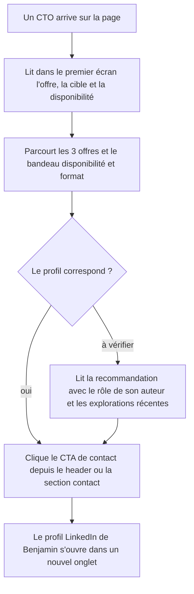
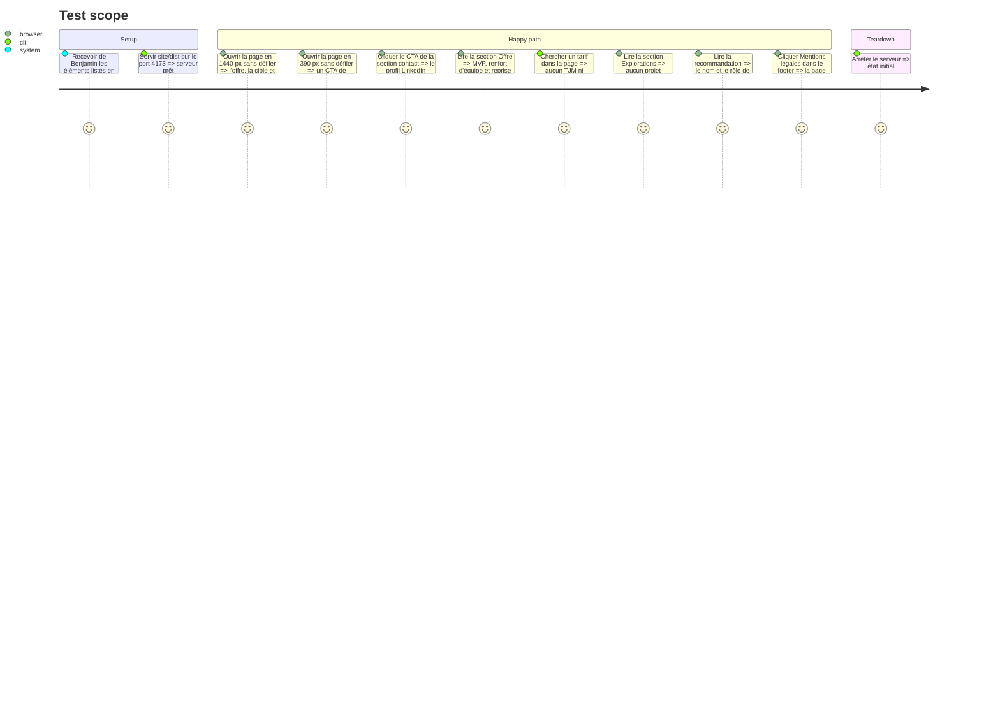

<!-- Fill or omit these sections; never add, rename, or reorder one. -->

# Instruction: Offre, contact et crédibilité

## Architecture projection

> Tree of the final files. ✅ create · ✏️ modify · ❌ delete

```txt
.
└── site/
    ├── README.md                 ✏️ sources du contenu mises à jour (éléments fournis par Benjamin, date)
    └── dist/
        ├── index.html            ✏️ hero explicite, section Expertise → Offre, Explorations, recommandation, CTA LinkedIn visible en mobile, lien mentions légales
        ├── mentions-legales.html ✅ éditeur (Alphard SASU), directeur de publication, hébergeur, données personnelles
        └── styles.css            ✏️ bandeau d'infos pratiques, CTA header visible sur mobile, année des projets, page mentions légales
```

## User Journey



## Test Scope



## Wireframe

```txt
┌──────────────────────────────────────────────────────────────┐
│ (1) Header : wordmark · Offre · Expérience · Explorations ·   │
│              [CTA contact] (visible aussi en mobile)          │
├──────────────────────────────────────────────────────────────┤
│ (2) Hero : titre actuel + portrait                            │
│     sous-titre : ce que je fais, pour qui                     │
│     (3) ligne dispo : disponibilité · remote/Strasbourg       │
│     [Me contacter]  [Voir le cas Tilli]                       │
├──────────────────────────────────────────────────────────────┤
│ (4) 01 / Offre                                                │
│  ┌────────────┐ ┌────────────┐ ┌────────────┐                 │
│  │ MVP        │ │ Renfort    │ │ Reprise    │                 │
│  │ pour qui   │ │ pour qui   │ │ pour qui   │                 │
│  │ livrable   │ │ livrable   │ │ livrable   │                 │
│  │ durée      │ │ durée      │ │ durée      │                 │
│  └────────────┘ └────────────┘ └────────────┘                 │
│  (5) bandeau : dispo · format · stack confirmée               │
├──────────────────────────────────────────────────────────────┤
│ (6) 02 / Parcours (inchangé)  ·  03 / Tilli (phase 4)         │
├──────────────────────────────────────────────────────────────┤
│ (7) 04 / Explorations : projet · année · description · tags   │
├──────────────────────────────────────────────────────────────┤
│ (8) Recommandation : citation · nom · rôle · lien             │
├──────────────────────────────────────────────────────────────┤
│ (9) Contact : [Échanger sur LinkedIn]                         │
│     rappel dispo et format · note Alphard SASU                │
├──────────────────────────────────────────────────────────────┤
│ (10) Footer : GitHub · LinkedIn · Mentions légales            │
└──────────────────────────────────────────────────────────────┘
```

1. Header : navigation renommée, CTA de contact conservé en mobile sous une forme compacte.
2. Hero : l'accroche visuelle reste, le sous-titre devient une proposition de valeur explicite.
3. Ligne de disponibilité : la première question d'un recruteur, visible sans défiler.
4. Offre : remplace « Expertise », une carte par offre de la bio GitHub avec cible, livrable et durée.
5. Bandeau pratique : disponibilité, format et compétences confirmées, sans tarif.
6. Parcours inchangé ici ; le cas Tilli est traité en phase 4.
7. Explorations : remplace « Open source », projets récents datés.
8. Recommandation : auteur identifié par son rôle, recommandations supplémentaires si fournies.
9. Contact : LinkedIn reste l'unique canal, rappel de la disponibilité et du format.
10. Footer : ajout du lien vers les mentions légales.

## Tasks to do

### `1)` Collecter le contenu auprès de Benjamin

> Aucun fait n'est inventé ; la phase est bloquée tant que ces éléments manquent. Déjà décidé par Benjamin le 2026-10-07 : les 3 offres de la bio GitHub (MVP, renfort d'équipe, reprise d'applications), contact uniquement via LinkedIn, aucun TJM affiché.

1. Pour chaque offre : la cible, le livrable et une durée typique.
2. Disponibilité et format (remote, présentiel à Strasbourg, jours par semaine).
3. Compétences réellement pratiquées à ajouter (ex. TypeScript, tests, CI/CD, cloud, IA) ; missions ou clients depuis Tilli, s'il y en a et s'ils sont publiables.
4. Façon d'entrer dans une base de code et une équipe existantes (premiers jours, revue de code, documentation), pour les offres Renfort et Reprise.
5. Rôle de Laura Petit chez Tilli ; textes exacts et accord pour 1 ou 2 recommandations supplémentaires.
6. Mentions légales : dénomination, forme, capital, adresse du siège, RCS/SIREN, n° TVA, directeur de publication, téléphone et adresse e-mail. Ces coordonnées sont exigées sur la page des mentions légales même si le contact commercial passe par LinkedIn.
7. Explorations à garder (proposition : `chrome-car` 2026, `shopping-list` 2022 ; retrait de `survival-aframe` 2016 et du plugin Gatsby).

### `2)` Rendre le premier écran explicite

> En 5 secondes, un CTO sait ce que Benjamin vend et s'il est disponible.

1. Remplacer le paragraphe du hero et la « signature » par une proposition de valeur basée sur les 3 offres.
2. Ajouter la ligne de disponibilité et de format.
3. Garder le CTA de contact dans le header en mobile (ancre `#contact`).
4. Mettre à jour la meta description et `og:description` en cohérence.

### `3)` Transformer « Expertise » en « Offre »

> Trois offres concrètes et les infos pratiques, sans tarif.

1. Réécrire les 3 cartes : MVP, renfort d'équipe, reprise d'applications (cible, livrable, durée) ; pour Renfort et Reprise, indiquer comment Benjamin s'intègre dans une base de code existante.
2. Ajouter le bandeau pratique (disponibilité, format) ; ne mentionner ni TJM ni « tarif sur demande ».
3. Remplacer le tag « Applications hybrides » par « iOS & Android ».
4. Compléter le bandeau de stack avec les seules compétences confirmées en tâche 1.
5. Renommer l'ancre et la navigation (`#offre`).

### `4)` Remplacer « Open source » par « Explorations »

> Ne montrer que ce qui sert le profil aujourd'hui.

1. Renommer la section, son titre et l'entrée de navigation.
2. Retirer `survival-aframe` et `gatsby-plugin-nullish-coalescing-operator`.
3. Ajouter `chrome-car` avec la description de son dépôt.
4. Afficher l'année du dernier travail sur chaque projet.

### `5)` Renforcer la preuve sociale et le contact

> Rendre la recommandation vérifiable et le contact LinkedIn immédiat.

1. Ajouter le rôle de Laura Petit ; intégrer les recommandations supplémentaires fournies.
2. Garder « Échangeons sur LinkedIn » comme unique action de contact ; formuler l'invitation pour qu'un CTO sache quoi écrire (besoin, délai, format).
3. Rappeler disponibilité et format dans la section contact.

### `6)` Publier les mentions légales

> Respecter l'obligation légale d'une SASU.

1. Créer `mentions-legales.html` avec le même header, footer et la même feuille de style.
2. Renseigner éditeur, contact légal (téléphone, e-mail), directeur de publication et hébergeur (GitHub Inc., coordonnées vérifiées sur la documentation GitHub).
3. Ajouter un paragraphe sur les données personnelles : aucun cookie, aucune mesure d'audience, aucun formulaire.
4. Ajouter le lien dans le footer de la page d'accueil.

### `7)` Mettre à jour la documentation

> Garder une trace de l'origine du contenu.

1. Dans `site/README.md`, indiquer que les nouveaux contenus ont été fournis par Benjamin, avec la date.

## Test acceptance criteria

| Task | Acceptance criteria |
| ---- | ------------------- |
| 1 | Chaque élément affiché par cette phase correspond à une réponse de Benjamin ; rien n'est déduit ni inventé. |
| 2 | En 1440 et 390 px, l'offre, la cible et la disponibilité sont visibles sans défiler, et un CTA de contact est présent dans le header. |
| 3 | La section Offre présente MVP, renfort d'équipe et reprise d'applications avec cible, livrable et durée ; les cartes Renfort et Reprise expliquent l'intégration dans une base existante ; un bandeau affiche dispo et format ; aucun tarif n'apparaît ; le mot « hybrides » n'apparaît plus. |
| 4 | La section s'intitule « Explorations », ne contient aucun projet antérieur à 2022, inclut `chrome-car` et affiche une année par projet. |
| 5 | La recommandation affiche le rôle de son auteur ; tous les CTA de contact mènent au profil LinkedIn ; la page d'accueil ne contient aucun `mailto:` ni lien de réservation. |
| 6 | `mentions-legales.html` affiche dénomination, forme, capital, siège, RCS, TVA, téléphone, e-mail, directeur de publication et hébergeur, et elle est accessible depuis le footer. |
| 7 | `site/README.md` indique l'origine et la date des nouveaux contenus. |
