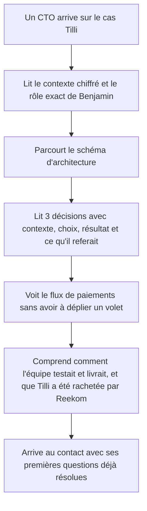
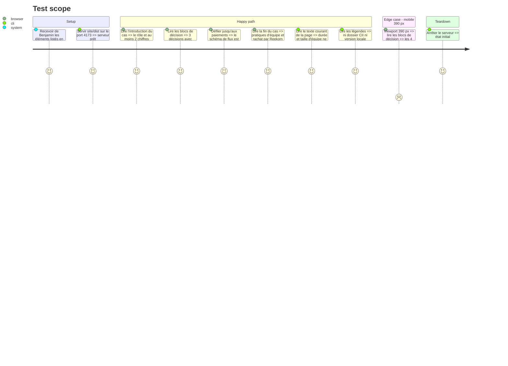

<!-- Fill or omit these sections; never add, rename, or reorder one. -->

# Instruction: Cas Tilli réécrit autour de décisions techniques

## Architecture projection

> Tree of the final files. ✅ create · ✏️ modify · ❌ delete

```txt
.
└── site/
    ├── README.md          ✏️ origine et date des nouveaux contenus Tilli
    └── dist/
        ├── index.html     ✏️ section Tilli restructurée : contexte chiffré, 3 décisions, pratiques d'équipe, après Tilli ; doublons avec Parcours retirés
        └── styles.css     ✏️ blocs de décision (contexte → choix → résultat → à refaire), figure paiements visible
```

## User Journey



## Test Scope



## Wireframe

```txt
┌──────────────────────────────────────────────────────────────┐
│ (1) 03 / Expérience · Tilli — titre                           │
│     rôle exact · période · chiffres d'échelle (2 à 4)          │
├──────────────────────────────────────────────────────────────┤
│ (2) Contexte métier (court) + schéma d'architecture           │
├──────────────────────────────────────────────────────────────┤
│ (3) Décision 1 : API commune + Tilli Core                     │
│     ┌─────────┬─────────┬──────────┬──────────────┐           │
│     │Contexte │ Choix   │ Résultat │ À refaire    │           │
│     └─────────┴─────────┴──────────┴──────────────┘           │
│ (4) Décision 2 : algorithme d'affectation des missions        │
│     même structure                                            │
│ (5) Décision 3 : paiements marketplace (Mangopay)             │
│     même structure + figure du flux de paiements              │
├──────────────────────────────────────────────────────────────┤
│ (6) Galeries : parcours web · app artisans (légendes nettoyées)│
├──────────────────────────────────────────────────────────────┤
│ (7) Comment l'équipe travaillait : recrutement, tests, CI,    │
│     déploiement, hébergement                                  │
├──────────────────────────────────────────────────────────────┤
│ (8) Après Tilli : fin de l'aventure, passation · technologies │
└──────────────────────────────────────────────────────────────┘
```

1. En-tête du cas : rôle, période et chiffres d'échelle fournis par Benjamin, sans répéter le bloc Parcours.
2. Contexte et architecture : le schéma existant reste, le texte descriptif est raccourci.
3. Décision sur l'architecture partagée.
4. Décision sur l'algorithme d'affectation, aujourd'hui cité en une demi-phrase.
5. Décision sur les paiements, avec le schéma sorti de son volet repliable.
6. Galeries existantes, légendes sans jargon interne.
7. Pratiques d'équipe : ce qui manque aujourd'hui pour juger la maturité technique.
8. Fin de Tilli expliquée en amont de la question du recruteur : rachat par Reekom, puis nouveau projet de Benjamin.

## Tasks to do

### `1)` Collecter le contenu auprès de Benjamin

> Les décisions et les chiffres viennent de lui ; la phase est bloquée sans eux. Déjà fourni par Benjamin le 2026-10-07 : Tilli a été rachetée par Reekom, et il a choisi de faire autre chose ensuite.

1. Trois décisions (proposition : API commune et Tilli Core, algorithme d'affectation, paiements Mangopay ; alternative : ETL MongoDB → MySQL) avec contexte, choix, résultat et ce qu'il referait.
2. Deux à quatre chiffres d'échelle publiables (artisans, commandes, villes, marques partenaires, volume traité…).
3. Rôle exact dans l'équipe : recrutement, management des 8 personnes, part de code.
4. Pratiques : tests, CI/CD, déploiement, hébergement, astreinte.
5. Date du rachat par Reekom, si Benjamin souhaite l'afficher.

### `2)` Restructurer la section Tilli

> Passer d'une description du système à une démonstration de jugement technique.

1. Réécrire l'en-tête : rôle, période, chiffres d'échelle.
2. Raccourcir les trois paragraphes descriptifs autour du schéma d'architecture.
3. Créer un composant de décision réutilisable (contexte, choix, résultat, à refaire), en grille sur desktop et empilé en mobile.
4. Écrire les 3 décisions.

### `3)` Mettre les paiements en avant

> Le sujet le plus « CTO » de la page ne doit plus être caché.

1. Sortir la figure du flux de paiements du `<details>` et la placer dans la décision paiements.
2. Conserver son fond blanc et son texte alternatif.

### `4)` Ajouter pratiques d'équipe et après Tilli

> Répondre d'avance aux questions du premier appel.

1. Ajouter un bloc « Comment l'équipe travaillait ».
2. Ajouter un bloc « Après Tilli » : rachat de Tilli par Reekom, puis choix de Benjamin de se consacrer à autre chose, son activité freelance. Ton factuel et positif, sans date si elle n'est pas fournie ; le rattacher à la mention existante du deck de passation de novembre 2025.
3. Garder la ligne Technologies en fin de section, complétée si besoin.

### `5)` Nettoyer doublons et légendes

> Une information à un seul endroit, sans jargon interne.

1. Retirer de la section Tilli la phrase « des premières lignes de code à une équipe tech de huit personnes » déjà portée par Parcours.
2. Retirer « présentée dans le dossier CII » et « capture d'une version locale » des légendes ; garder seulement ce que montre l'image.
3. Mettre à jour `site/README.md` (origine et date des contenus).

## Test acceptance criteria

| Task | Acceptance criteria |
| ---- | ------------------- |
| 1 | Chaque chiffre, décision et explication publiée correspond à une réponse validée par Benjamin. |
| 2 | La section présente le rôle, au moins 2 chiffres d'échelle et 3 décisions, chacune avec ses 4 rubriques ; en 390 px les rubriques s'empilent sans débordement horizontal. |
| 3 | Le schéma des paiements est visible sans interaction ; la page ne contient plus d'élément `<details>`. |
| 4 | Les blocs « Comment l'équipe travaillait » et « Après Tilli » sont présents ; ce dernier mentionne le rachat par Reekom et le choix de Benjamin de passer à autre chose. |
| 5 | La durée (9 ans) et la taille d'équipe (8 personnes) ne sont énoncées qu'une fois en texte courant, titres et bloc de chiffres clés exceptés ; aucune légende ne contient « CII » ni « version locale ». |
